
# Proyecto final - Electrónica Digital 1 - 2025-II

# Integrantes

Paulina Jimenez Vargas (pajimenezv@unal.edu.co)

Alina Idaly Ortiz Martinez (alortizma@unal.edu.co)

Jana Rubiano Hurtado (jrubianoh@unal.edu.co)

# Nombre del proyecto
**Nutripet - Dispensador automático de alimento para mascotas**

El objetivo principal del proyecto es diseñar un sistema capaz de controlar la dispensación de alimento de forma automática, empleando módulos digitales descritos en Verilog que gestionan sensores, temporizadores y el control de un motor que se encargará de girar el dispositivo para entregar la comida del animal.

# Prototipo físico 
Se llevó a cabo el diseño y la impresión del siguiente diseño.

  

# Descripción de la Arquitectura
Para la realización del proyecto, se emplearon diversos recursos típicos de la descripción de hardware, incluyendo lógica combinacional (como multiplexores y compuertas), descripción comportamental mediante bloques always, estructuras de control similares a las de la programación clásica (como if) y componentes más avanzados como máquinas de estado y módulos que implementan protocolos de comunicación.

## Diagrama de bloques 

  

La arquirectura del sistema esta basada en la la tarjeta de desarrollo Cyclone IV, la cual contiene una FPGA. Esta se encarga de coordinar la lógica del dispensador automatico mediante tres bloques internos, los cuales son el temporizador, el contador de porciones y el módulo de interacción entre los sensores y componentes externos. 

La FPGA recibe información de un sensor de proximidad, controla el motor paso a paso mediante un drives y actualiza la pantalla LCD mediante texto dinámico continuamente con la información proveniente tanto del temporizador como del contador de porciones. Si el animal se encuentra muy cerca del dispensador, la tapa no se moverá y el temporizador no seguirá contando hasta que se retire. Por último el dispensador enviará un mensaje por medio de bluetooth cuando se acaben las porciones.

## Maquinas de estado. 

Se utilizaron maquinas de estado tanto para la LCD como para el modulo bluetooth.

Para la LCD, 

  

La máquina de estados controla paso a paso lo que la pantalla LCD debe hacer. Primero, cuando el sistema enciende o se reinicia, todo comienza en el estado IDLE, que es simplemente una espera inicial. Cuando la LCD está lista, la máquina avanza y envía una serie de comandos de configuración necesarios para dejar la pantalla lista para usar.

Después de configurar la LCD, la máquina escribe un texto fijo en la primera línea y luego en la segunda línea. Una vez termina esa etapa, pasa al último estado, donde se encarga de actualizar continuamente la información dinámica en pantalla, cambiando constantemente la hora y el número de porciones restantes.

En caso de ocurrir un reset, la máquina vuelve directamente al estado inicial (IDLE), sin importar en qué parte del proceso se encuent

Para el modulo bluetooth se utilizó la siguiente maquina de estados.

  

La función de esta es esperar la señal para cargar el mensaje, enviarlo y volver a esperar el mensaje.

## Protocolos 

Los protocolos juegan un papel bastante importante en la organización de comunicación entre los dispositivos, y se diseñan de diferentes maneras segun los requisitos y usos del sistema. 

Los microcontroladores, sistemas integrados y computadores utilizan principalmente el protocolo UART, el cual se especializa en la comunicación serial asincróna.

Las señales de UART son el transmisor (Tx) y el receptor (Rx), para asi enviar y recibir datos en serie. 

La transmisión de datos se realiza en forma de paquetes seriales, que constan de un bit de inicio, datos, un bit de paridad y bits de parada.

  

En el caso del proyecto, este protocolo fue aplicado para la transmisión de datos por bluetooth. En el modulo de "uart_tx" se puede observar que se siguen todos los pasos de la imagen anterior, enviando los datos uno tras otro a una determinada velocidad. El modulo recibe un dato, lo convierte a  un paquete de datos UART y lo envia bit por bit a la linea de salida.

# Diagramas de la Arquitectura
### Temporizador.

  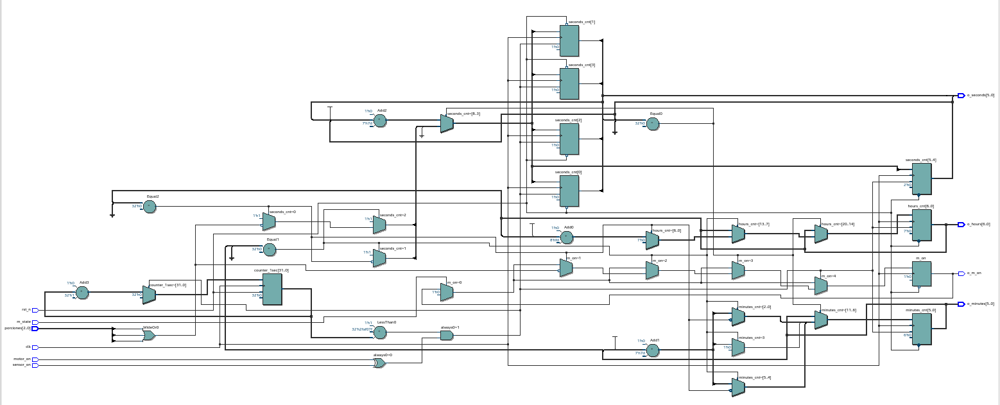
   
  <em>Diagrama de circuito del temporizador.</em>

  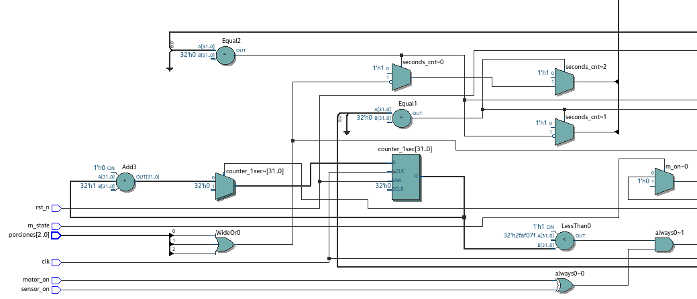
   
  <em>Diagrama de circuito del temporizador.</em>

  
   
  <em>Diagrama de circuito del temporizador.</em>

  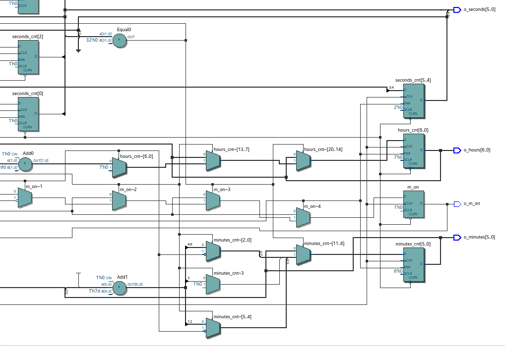
   
  <em>Diagrama de circuito del temporizador.</em>

Este circuito lleva el control del tiempo usando un contador principal que va avanzando con cada pulso del reloj, y ese contador sirve como base para generar los segundos. Para manejar cada dígito del tiempo, el circuito usa varios contadores independientes, destinados para las unidades y decenas de los segundos, minutos y horas. Cada contador está conectado a comparadores, que son los bloques que revisan si el valor ya llegó al máximo. Cuando un comparador detecta que ya se alcanzó ese límite, se envía una señal para que el contador correspondiente se reinicie y, al mismo tiempo, haga avanzar el siguiente contador de la cadena. Además, hay sumadores que se encargan de incrementar los valores y selectores que deciden cuándo usar el número incrementado, cuándo mantenerlo igual o cuándo ponerlo en cero, dependiendo del estado actual. También aparecen pequeñas compuertas que habilitan o bloquean el avance según señales como el reinicio, el reloj o el encendido del motor y del sensor. En conjunto, estos componentes permiten que el circuito construya un reloj digital interno donde los segundos avanzan, arrastran a los minutos cuando completan un ciclo, y los minutos hacen lo mismo con las horas, manteniendo siempre un conteo correcto y automático.

### Motor.

  
   
  <em>Diagrama de circuito del divisor de frecuencia.</em>

El circuito está formado por un contador, un comparador y un registro de salida. El contador se implementa con un registro de 28 bits y un sumador, en cada pulso del reloj (clk), el sumador incrementa el valor almacenado en el registro. Cuando el contador llega al número programado, el comparador detecta la coincidencia y genera una señal de activación.Esa señal se guarda en un registro final, que produce el pulso de salida (clk_1). Luego el contador vuelve a iniciar y el proceso se repite. De esta manera, la salida cambia estado solo después de un número determinado de ciclos del reloj original, lo que genera una frecuencia más baja que se usa para el motor.El módulo divide la frecuencia usando tres bloques principales, un contador, comparador y registro de salida.

  
   
  <em>Diagrama de circuito del motor.</em>

Este módulo es un generador de patrón de 4 bits sincronizado cuyo control de secuencia se basa en un Contador de 3 bits. El contador se incrementa síncronamente mediante un Sumador al ritmo del reloj (clk_1), pero solo cuando la señal de habilitación motor_activo se encuentra activa en su entrada. El valor binario de este contador se utiliza como entrada para un Decodificador que activa una única línea de salida para cada estado de la secuencia. Estas ocho líneas decodificadas se enrutan a través de un conjunto de cuatro compuertas OR que definen el patrón específico de 4 bits deseado para cada estado. Finalmente, el patrón generado por estas compuertas OR se carga en el Registro de Salida en el flanco ascendente del reloj, lo que garantiza que la señal de control final sea estable y esté perfectamente sincronizada con el resto del sistema digital.

### Sensor de proximidad.

El primer diagrama es el detalle interno del módulo, mientras que el segundo muestra su uso externo. La salida del módulo, generada a partir del contador y el comparador, se toma como señal limpia y se almacena en otro registro para que el resto del sistema la utilice. Todo el procesamiento interno queda oculto cuando el módulo se integra.

  
   
  <em>Diagrama de circuito del antirrebote.</em>

El primer diagrama muestra los componentes que forman el módulo del antirrebote. Primero aparece un registro (btn_sync) que sincroniza la entrada con el reloj del sistema. Desde ahí, la señal pasa a una pequeña lógica combinacional que controla un contador. El contador está formado por un sumador de 13 bits y un registro, donde el sumador calcula el siguiente valor y el registro lo almacena en cada ciclo de reloj. Un comparador digital verifica cuando el contador llega a un valor establecido, y cuando esto ocurre activa la señal interna que define la salida. Esta señal se guarda en un registro final (clean_reg), que entrega un resultado estable y alineado al reloj. Compuesto principalmente por un registro de entrada, un contador con comparador y un registro de salida.

  
   
  <em>Diagrama de circuito del sensor infrarrojo.</em>

En el segundo diagrama, el módulo anterior aparece integrado como un bloque completo con nombre debouncer_inst. Solo se muestran sus puertos: la entrada, el reloj y su salida limpia. La salida del módulo pasa por un multiplexor que selecciona la señal a utilizar y luego entra a un registro que guarda el valor final. Aquí ya no se ven los componentes internos, porque todo está encapsulado dentro del módulo, y solo se usa su resultado. Por lo que el diagrama muestra cómo el módulo se conecta con el resto del circuito mediante elementos simples como un multiplexor y un registro.

### Pantalla LCD 

  
   
  <em>Diagrama de circuito del texto en la LCD.</em>

  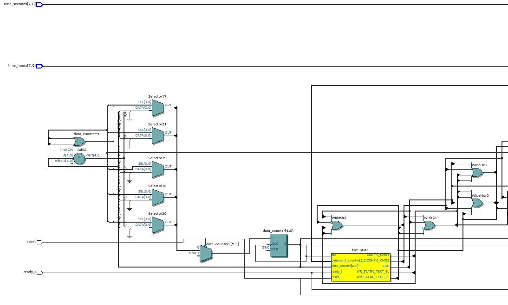
   
  <em>Diagrama de circuito del texto en la LCD.</em>

  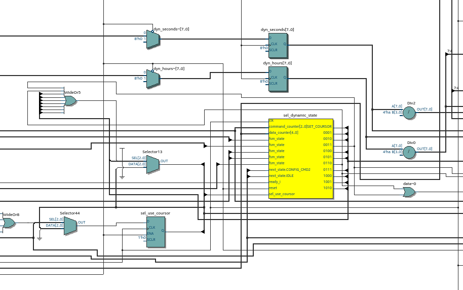
   
  <em>Diagrama de circuito del texto en la LCD.</em>

  
   
  <em>Diagrama de circuito del texto en la LCD.</em>

Este circuito es un controlador completo para una pantalla LCD tipo 1602. Primero, en la parte izquierda se encuentran los bloques que preparan la información que debe escribirse en la pantalla a través de multiplexores y comparadores que seleccionan qué dato enviar, dependiendo del estado del sistema y de las instrucciones internas. En la parte central aparece una máquina de estados, que es la encargada de decidir en qué etapa va el envío de datos, como la inicialización de la pantalla, el envío de comandos o la transmición de los caracteres. Esa máquina activa cada bloque cuando corresponde. Hacia la derecha se encuentra la parte más grande del circuito, donde están los registros y multiplexores que almacenan cada bit del dato que se va a mostrar, junto con las señales necesarias del LCD (RS, RW y EN). Esta zona se encarga de sacar cada bit en el orden correcto y sincronizarlo con el pulso de habilitación. Finalmente, al extremo derecho están las salidas que llegan directamente a la pantalla, donde cada línea representa una señal concreta que el LCD necesita. En conjunto, todos estos componentes permiten que el circuito tome un mensaje, lo divida en bits, genere los comandos adecuados y los envíe a la pantalla paso a paso para que el texto aparezca correctamente.

### Módulo Bluetooth

  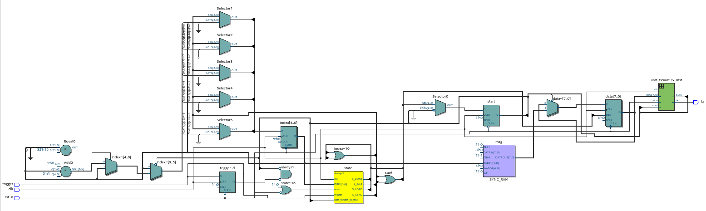
   
  <em>Diagrama de circuito del texto Bluetooth.</em>

  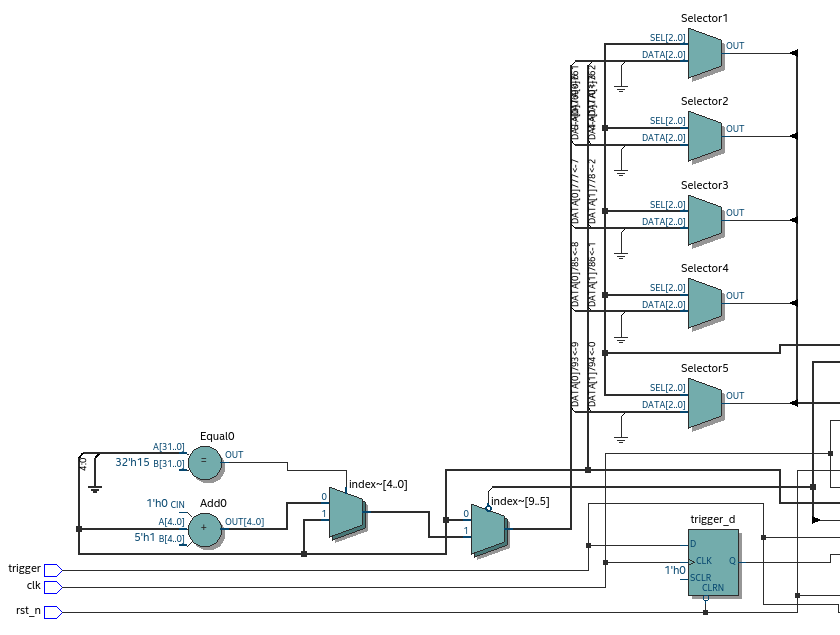
   
  <em>Diagrama de circuito del texto Bluetooth.</em>

  
   
  <em>Diagrama de circuito del texto Bluetooth.</em>

Este circuito es el encargado de enviar un mensaje por Bluetooth cuando recibe una señal de “trigger”. Lo que hace es recorrer un mensaje guardado en memoria y, usando varios selectores y contadores, va escogiendo byte por byte para enviarlo en orden. Una máquina de estados coordina todo el proceso, es decir, cuándo cargar el siguiente byte, cuándo pedirle al transmisor que envíe, y cuándo avanzar hasta terminar el mensaje. Cada byte pasa luego al módulo UART, que es el encargado de convertirlo en la señal serial. Finalmente, la salida “tx” del sistema se conecta al módulo Bluetooth HM-10.

  
   
  <em>Diagrama de circuito del protocolo UART.</em>

  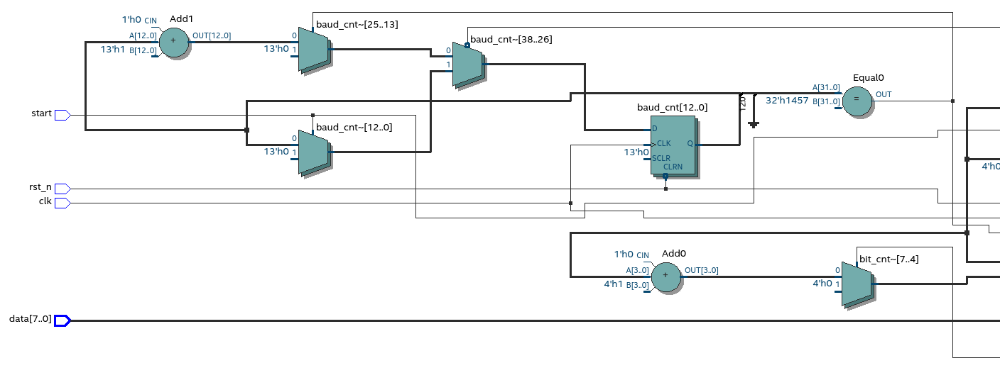
   
  <em>Diagrama de circuito del protocolo UART.</em>

  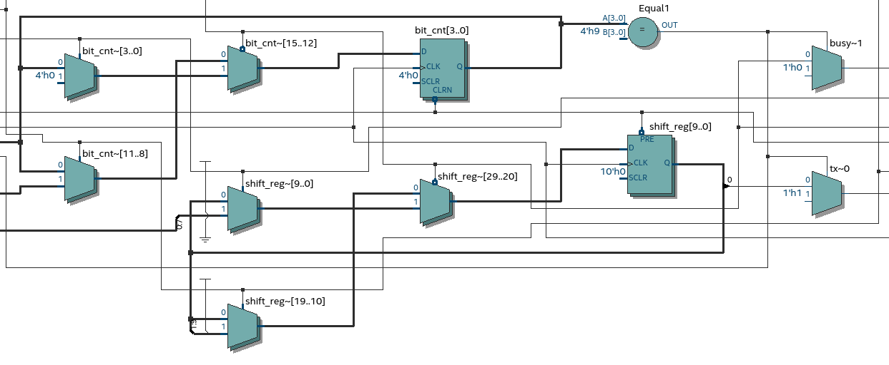
   
  <em>Diagrama de circuito del protocolo UART.</em>

  
   
  <em>Diagrama de circuito del protocolo UART.</em>

Este segundo diagrama corresponde al transmisor UART, que es quien convierte cada byte que recibe en una señal serial. Tiene varios contadores que generan la velocidad de transmisión (baud rate) y que llevan la cuenta de los bits que ya se han enviado. El byte entra a un registro que va “corriendo” sus bits hacia afuera uno por uno, comenzando por el bit de inicio y terminando en el bit de parada. El módulo también indica cuándo está ocupado enviando (busy) y produce la señal final “tx”, que es la que se transmite.

  
   
  <em>Diagrama de circuito del módulo Bluetooth.</em>

El último diagrama muestra cómo se integra todo el sistema como un módulo llamado “HM10sender”. Este bloque recibe el reloj principal de 50 MHz, una señal de reinicio y el trigger que activa el envío del mensaje. Su única salida es “bt_tx”, que es donde aparece la señal UART ya preparada para ir directamente al módulo Bluetooth HM-10, resumiendo todo el diseño en una sola caja con sus entradas y salida principales.

### Módulo top

  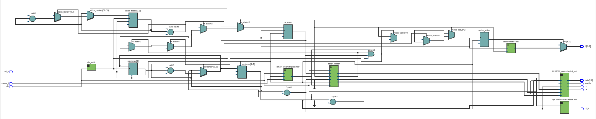
   
  <em>Diagrama de circuito del módulo top.</em>

  
   
  <em>Diagrama de circuito del módulo top.</em>

  
   
  <em>Diagrama de circuito del módulo top.</em>

  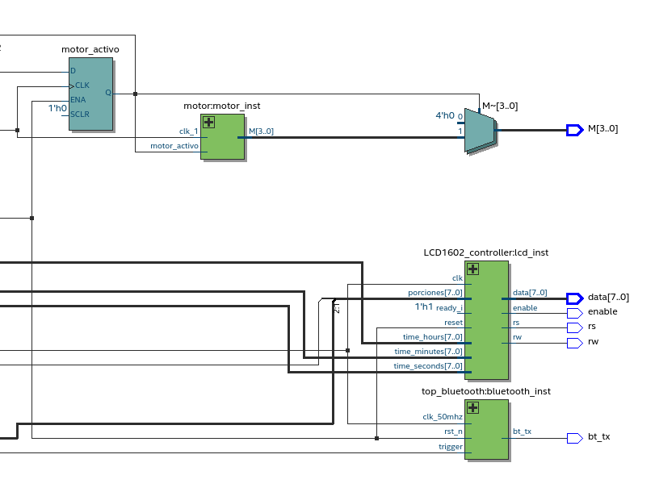
   
  <em>Diagrama de circuito del módulo top.</em>

El sistema funciona tomando primero las señales de entrada como el sensor, el reloj y el reset, las cuales se distribuyen a los diferentes bloques del circuito. A partir del reloj, los registros y contadores comienzan a trabajar de forma sincronizada, permitiendo que la máquina de estados controle el proceso paso a paso. Los comparadores evalúan condiciones como si un valor ya alcanzó un límite o si el tiempo definido por el temporizador se cumplió, y con base en eso se generan las señales que activan o desactivan el motor. Estos estados y condiciones determinan cuándo el motor está en funcionamiento y cuándo debe detenerse. Al mismo tiempo, la información generada por los estados y contadores se envía al controlador de la pantalla LCD, que se encarga de mostrar los datos correspondientes al estado actual del sistema. 

# Simulaciones

## Temporizador

## Motor

  
   
  <em>Simulación en GTKwave del funcionamiento del motor.</em>

## Sensor de Proximidad

## Pantalla LCD

##  Módulo Bluetooth

# Bibliografía
[1] Digital Electronics UNAL, “2025-2,” GitHub repository. https://github.com/digital-electronics-UNAL/2025-2 (accedido Dec. 14, 2025).

[2] “Verilog Tutorial,” *ChipVerify*, https://www.chipverify.com/tutorials/verilog (accedido Dec. 14, 2025). :contentReference[oaicite:0]{index=0}

[3] Ovisign Verilog HDL Tutorials, «FPGA project 08 Part1 - Digital BCD Timer», YouTube. 16 de octubre de 2022. [En línea]. Disponible en: https://www.youtube.com/watch?v=04KTw--Y5Ec

[4] «Verilog code for Alarm clock on FPGA», FPGA4student.com. https://www.fpga4student.com/2016/11/verilog-code-for-alarm-clock-on-fpga.html

[5] Pavanakp, «Basics of Bluetooth Module», LearnElectronics India, 14 de septiembre de 2024. https://www.learnelectronicsindia.com/post/basics-of-bluetooth-module

[6] C. Prados Sesmero, «Control de Dispositivos Externos, desde una FPGA, vía Bluetooth», Universidad de Valladolid, 2018. [En línea]. Disponible en: https://share.google/OEYmx88MDeVb9psRn

[7] Admin, «Sensor de proximidad», Industrias GSL, 1 de marzo de 2022. https://industriasgsl.com/blogs/automatizacion/sensor_de_proximidad

# Evidencias de implementación

Para verificar la implementación de los elementos, se puede consultar el siguiente enlace, donde se encuentran videos que muestran algunas de las funcionalidades desarrolladas en el proyecto. [Ver en Google Drive](https://drive.google.com/drive/folders/181sdODDXI2fHAPDyi-euoFiO8eSgnvUJ)
